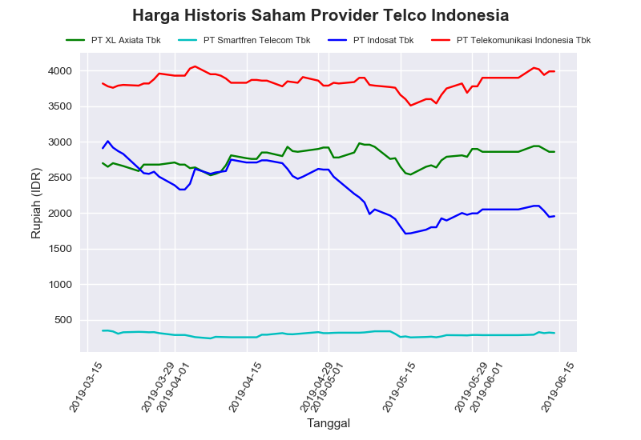
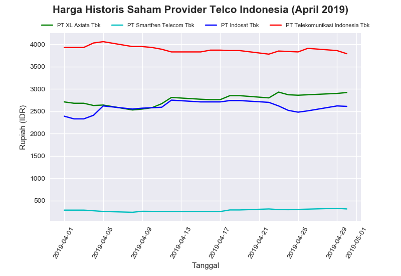

# Ujian Data Science - Analytics & Visualization - Soal No. 3

#

### **Soal 3 - Harga Historis Saham Provider Telco Indonesia**

Menggunakan data saham yang dapat didownload:

Nama Provider|Unduh csv
-----|-----
PT. XL Axiata Tbk|[EXCL.JK.csv](./dataSaham/EXCL.JK.csv)
PT Smartfren Telecom Tbk|[FREN.JK.csv](./dataSaham/FREN.JK.csv)
PT Indosat Tbk|[ISAT.JK.csv](./dataSaham/ISAT.JK.csv)
PT Telekomunikasi Indonesia Tbk|[TLKM.JK.csv](./dataSaham/TLKM.JK.csv)

Dibuat grafik perbandingan harga saham:

#

1. Harga penutupan (close) harian dari ke-4 perusahaan telco selama 3 bulan terakhir:

    
#

2. Harga penutupan (close) harian dari ke-4 perusahaan telco selama __bulan April 2019__:

    
#

### **_Enjoy!_**

#

#### Albertus Rianto Wibisono ✉ _albertusrian95@gmail.com_

[Instagram](https://www.instagram.com/rian__wibisono) | 
[LinkedIn](https://www.linkedin.com/in/albertusrian95/) |
[GitHub](https://www.github.com/RiantoWibisono)